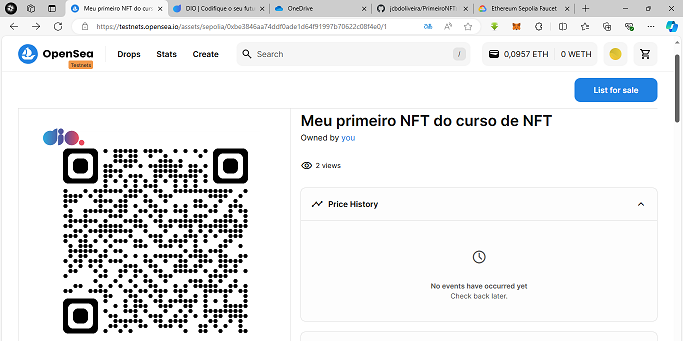
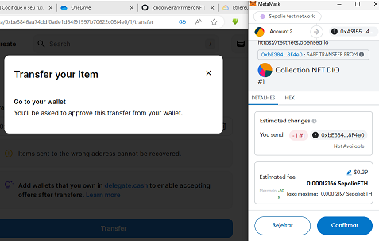
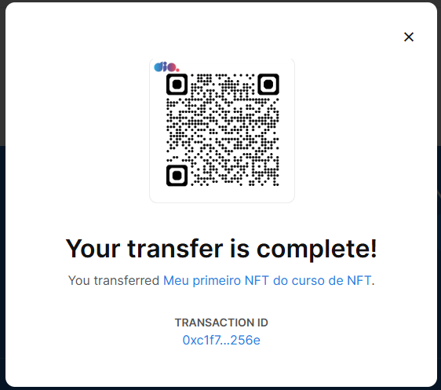

# Primeiro NFT
Primeiro NFT do curso de NFT da DIO

## Objetivo
Criar um NFT com a imagem abaixo e transferir para a carteira 
0xA9155F5B6FC993A82346a8ff86EFEf513fc4c096

## Tecnologias utilizadas
 * OpenSea https://testnets.opensea.io/
 * Metamask https://metamask.io/
 * Faucet https://cloud.google.com/application/web3/faucet/ethereum/sepolia

 ## NFT criado na OpenSea
 

 ## Tranferência para a carteira indicada
  

 ## Confirmação de envio
  

